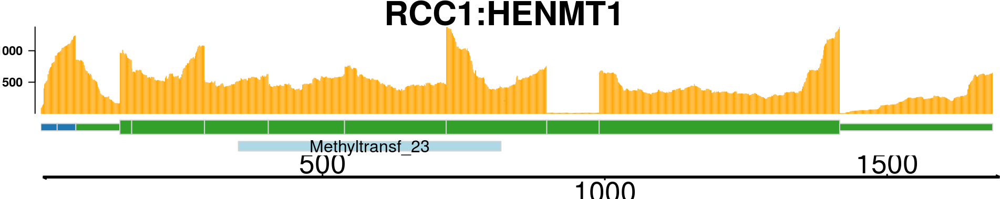

[](https://travis-ci.org/stianlagstad/chimeraviz) [](https://codecov.io/gh/stianlagstad/chimeraviz)

# chimeraviz

`chimeraviz` is an R package that automates the creation of chimeric RNA visualizations.

# Citations

If you wish to cite chimeraviz, please site [this application note](https://academic.oup.com/bioinformatics/article/33/18/2954/3835381).

Previous citations:
- [Alternative PDGFD rearrangements in dermatofibrosarcomas protuberans without PDGFB fusions](https://www.nature.com/articles/s41379-018-0089-4)
- [Transcriptional-Readthrough RNAs Reflect the Phenomenon of “A Gene Contains Gene(s)” or “Gene(s) within a Gene” in the Human Genome, and Thus Are Not Chimeric RNAs](http://www.mdpi.com/2073-4425/9/1/40)
- [FuSpot: a web-based tool for visual evaluation of fusion candidates](https://bmcgenomics.biomedcentral.com/articles/10.1186/s12864-018-4486-3)
- [Clinker: visualizing fusion genes detected in RNA-seq data](https://www.ncbi.nlm.nih.gov/pmc/articles/PMC6065480/)
- [Integrative analysis of DNA and RNA sequencing data from cancer](https://www.duo.uio.no/handle/10852/63165)

# Demo

The following is an excerpt of the [package vignette](https://bioconductor.org/packages/release/bioc/vignettes/chimeraviz/inst/doc/chimeraviz-vignette.html).

## Basic features

_chimeraviz_ allows you to import data from nine different fusion-finders: deFuse, EricScript, InFusion, JAFFA, FusionCatcher, FusionMap, PRADA, SOAPFuse, and STAR-FUSION. Getting started is easy:

```
# Load chimeraviz
library(chimeraviz)

# Get reference to results file from deFuse
defuse833ke <- system.file(
"extdata",
"defuse_833ke_results.filtered.tsv",
package="chimeraviz")

# Load the results file into a list of fusion objects
fusions <- import_defuse(defuse833ke, "hg19")
```

Import functions for the other supported fusion-finders are similarly named (for example `import_eriscript` or `import_infusion`).

A list of Fusion objects, objects that represent each fusion transcript, is now available in the list `fusions`.

```
length(fusions)
## [1] 17
```

As you can see, this list has 17 fusion objects. It is straightforward to find a specific fusion event and print information about it, or about each of the partner genes.

```
# Find a specific fusion event
fusion <- get_fusion_by_id(fusions, 5267)

# Show information about this fusion event
fusion
## [1] "Fusion object"
## [1] "id: 5267"
## [1] "Fusion tool: defuse"
## [1] "Genome version: hg19"
## [1] "Gene names: RCC1-HENMT1"
## [1] "Chromosomes: chr1-chr1"
## [1] "Strands: +,-"
## [1] "In-frame?: FALSE"

# Show information about the upstream fusion partner
upstream_partner_gene(fusion)
## [1] "PartnerGene object"
## [1] "Name: RCC1"
## [1] "ensemblId: ENSG00000180198"
## [1] "Chromosome: chr1"
## [1] "Strand: +"
## [1] "Breakpoint: 28834672"

# Show information about the downstream fusion partner
downstream_partner_gene(fusion)
## [1] "PartnerGene object"
## [1] "Name: HENMT1"
## [1] "ensemblId: ENSG00000162639"
## [1] "Chromosome: chr1"
## [1] "Strand: -"
## [1] "Breakpoint: 109202584"
```

## Plotting

### Overview plot

The overview plot is a nice way to get an overview over the nominated fusions in a sample. It will produce a circular plot like this one:


In this plot, you can see the following:

- All chromosomes with cytoband information
- Fusion events as links between locations in chromosomes (with gene names, if there is enough space in the plot)
- Red links indicate intrachromosomal fusions, while blue links indicate interchromosomal fusions
- The widths of each link varies according to how many reads support the fusion event. See the `plot_circle()` documentation for more detail on how this is computed

See how to build this plot in the package vignette: [Building the overview plot](https://bioconductor.org/packages/release/bioc/vignettes/chimeraviz/inst/doc/chimeraviz-vignette.html#building-the-overview-plot).

### Fusion reads plot

The fusion reads plot is a way to visualize the reads supporting a fusion event mapped to the putative fusion sequence. Many fusion finders report a putative fusion sequence, and by mapping reads to this sequence visualize how well the fusion event is supported. The function `plot_fusion_reads()` will, given enough data, produce a plot like this one:


As seen in the plot (you might want to open the image in a new tab and zoom in), this fusion event is supported by 6 paired end reads.

See how to build this plot in the package vignette: [Building the fusion reads plot](https://bioconductor.org/packages/release/bioc/vignettes/chimeraviz/inst/doc/chimeraviz-vignette.html#building-the-fusion-reads-plot).

### Fusion plot

The fusion plot is the main product of `chimeraviz`, created with the `plot_fusion` function. It will create a plot like this one:


Or, alternatively:


This plot holds a lot of information. You can see:

- Chromosome ideograms with a red line indicating the location of the two partner genes
- Transcript information showing exons in each partner gene
- The breakpoint between the partner genes, indicated with a red link
- Above the red link you can see the number of sequencing reads that support the fusion event
- Coverage information indicating the RNA expression level
- Genome coordinates (mega basepairs from the p-telomere)

The fusion you can see above is the `RCC1-HENMT1` fusion described by Andreas M. Hoff et al. in the paper [Identification of Novel Fusion Genes in Testicular Germ Cell Tumors (Cancer Research, 2016)](http://cancerres.aacrjournals.org/content/76/1/108.full).

Note that the plot reverses genes as necessary, so that the fused genes are plotted in the "correct" (5'-to-3') relative orientation.

See how to build this plot in the package vignette: [Building the fusion plot](https://bioconductor.org/packages/release/bioc/vignettes/chimeraviz/inst/doc/chimeraviz-vignette.html#building-the-fusion-plot).

### Fusion transcripts plot

If you are only interested in the transcripts of each partner gene in a fusion event, then it is not necessary to show all the information that is in the fusion plot. The transcripts plot is designed to give a simple view on the transcripts that might be included in the fusion transcript:


See how to build this plot in the package vignette: [Building the fusion transcripts plot](https://bioconductor.org/packages/release/bioc/vignettes/chimeraviz/inst/doc/chimeraviz-vignette.html#fusion-transcripts-plot).

### Fusion transcript plot

The fusion transcript plot shows the reduced version of all exons that could be part of a fusion transcript. This is a way to view all the possible parts of a fusion transcript merged into one.


See how to build this plot in the package vignette: [Building the fusion transcript plot](https://bioconductor.org/packages/release/bioc/vignettes/chimeraviz/inst/doc/chimeraviz-vignette.html#fusion-transcript-plot).

### Fusion transcript graph plot

All that is known about a fusion event is that a fusion-finder has scored a possible link between two genes. If there are four transcript variants of the upstream gene partner and four transcript variants of the downstream gene partner, then there are in total sixteen different splice variants of the finally processed fusion transcript. And that is only if we count the known, annotated variants of each gene. How can we make sense of all this? Plotting the transcript together as in previous plots helps, but there is a better way to visualize the putative fusion transcript: As a graph. By representing transcripts as a graph, with exons as nodes and splice junctions as edges, it is much easier to get a view on the putative fusion transcript.


See how to build this plot in the package vignette: [Building the fusion transcript plot](https://bioconductor.org/packages/release/bioc/vignettes/chimeraviz/inst/doc/chimeraviz-vignette.html#fusion-transcript-graph-plot).

### Fusion transcript plot with protein domain annotations

The fusion transcript plot with protein domain annotations shows a specific fusion transcript along with protein domain annotation data. If a bamfile is specified, the fusion transcript will be plotted with coverage information as well.



See how to build this plot in the package vignette: [Building the fusion transcript plot with protein domain annotations](https://bioconductor.org/packages/devel/bioc/vignettes/chimeraviz/inst/doc/chimeraviz-vignette.html#fusion-transcript-plot-with-protein-domain-annotations).

# Installing chimeraviz

`chimeraviz` is a Bioconductor package, and is most easily installed via Bioconductor. Please follow the installation instructions [here](https://bioconductor.org/packages/release/bioc/html/chimeraviz.html).

If you want to build the package yourself you can follow these instructions:
1. Install the dependencies listed under `Imports`, `Depends`, and `Suggests` in the [package DESCRIPTION file](https://github.com/stianlagstad/chimeraviz/blob/master/DESCRIPTION).
1. Run this command to install the package:
```
devtools::install_github(
  "stianlagstad/chimeraviz",
  build_vignettes = TRUE)
```

Please [create an issue on Github](https://github.com/stianlagstad/chimeraviz/issues) if you have any problems at all.

# Development

If you wish to make changes to chimeraviz, I recommend you use Docker. See the `README.md` file in the `docker` folder for more information.

# Tests

Tests are written with [testthat](https://cran.r-project.org/web/packages/testthat/index.html) and are located in `tests/testthat`. They can be run with `devtools::test()` if you have cloned this repository, _i.e._ not installed the package with `devtools::install_github()` but have used `git clone git@github.com:stianlagstad/chimeraviz.git chimeraviz`.

# Credits

This package was developed by Stian Lågstad for his master thesis: Visualizing chimeric RNA. The work was supervised by [Rolf Skotheim](http://ous-research.no/skotheim/) and [Ole Christian Lingjærde](http://www.mn.uio.no/ifi/personer/vit/ole/).

The thesis is available [here](https://www.duo.uio.no/handle/10852/51129). The application note in Oxford Bioinformatics is available [here](https://academic.oup.com/bioinformatics/article-lookup/doi/10.1093/bioinformatics/btx329).

# Licence

[Artistic Licence 2.0](https://opensource.org/licenses/Artistic-2.0).
